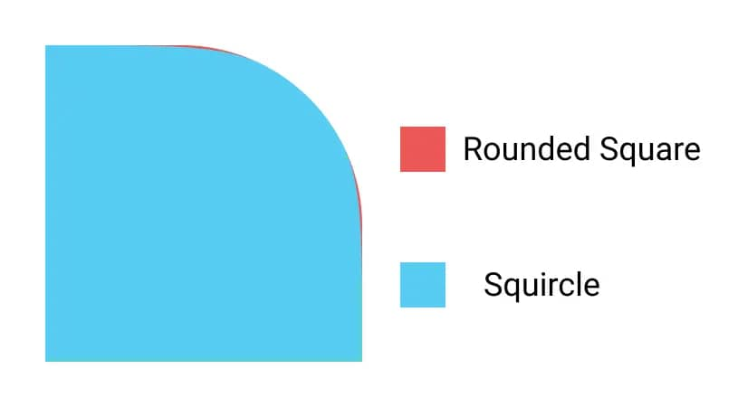

# React Native Figma Squircle

[](https://npm.im/react-native-figma-squircle) [](./LICENSE)

> Figma-flavored squircles for React Native

## Disclaimer

> This library is not an official product from the Figma team and does not guarantee to produce the same results as you would get in Figma.

## What is this?

Figma has a great feature called [corner smoothing](https://help.figma.com/hc/en-us/articles/360050986854-Adjust-corner-radius-and-smoothing), allowing you to create rounded shapes with a seamless continuous curve (squircles).



This library helps you bring those squircles to your React Native apps.

## Before you install

This library is a very light abstraction on top of [figma-squircle](https://github.com/tienphaw/figma-squircle). We also depend on [react-native-svg](https://github.com/react-native-svg/react-native-svg) to draw the SVG background. In many cases, it's a better idea to just use [figma-squircle](https://github.com/tienphaw/figma-squircle) directly:

- You can use [react-native-skia](https://shopify.github.io/react-native-skia/docs/shapes/path) instead of `react-native-svg`.
- More control and flexibility. For example, clipping can be done very easily using [Clip Path](https://shopify.github.io/react-native-skia/docs/group/#clip-path).

## Installation

Install [react-native-svg](https://github.com/software-mansion/react-native-svg)

Install this library:

```sh
npm install react-native-figma-squircle
```

Make sure [the New Architecture](https://reactnative.dev/architecture/landing-page) is enabled.
## Usage

A `SquircleView` can be used just like a normal `View`, except the background is rendered separately from the view background. So to change how it looks, you'll have to use the `squircleParams` prop instead of the `style` prop.

```jsx
import { SquircleView } from 'react-native-figma-squircle'

function PinkSquircle() {
  return (
    <SquircleView
      style={{ width: 200, height: 200 }}
      squircleParams={{
        cornerSmoothing: 0.7,
        cornerRadius: 30,
        fillColor: 'pink',
      }}
    />
  )
}
```

## Props

Inherits [View Props](https://facebook.github.io/react-native/docs/view#props)

### squircleParams

#### cornerSmoothing

> `number` | **Required**

Goes from 0 to 1, controls how smooth the corners should be.

#### cornerRadius

> `number` | defaults to `0`

#### topLeftCornerRadius

> `number`

#### topRightCornerRadius

> `number`

#### bottomRightCornerRadius

> `number`

#### bottomLeftCornerRadius

> `number`

#### fillColor

> `Color` | defaults to `#000`

Similar to `backgroundColor` in the `style` prop.

#### strokeColor

> `Color` | defaults to `#000`

Similar to `borderColor` in the `style` prop.

#### strokeWidth

> `number` | defaults to `0`

Similar to `borderWidth` in the `style` prop.

## Thanks

- Figma team for publishing [this article](https://www.figma.com/blog/desperately-seeking-squircles/) and [MartinRGB](https://github.com/MartinRGB) for [figuring out all the math](https://github.com/MartinRGB/Figma_Squircles_Approximation) behind it.
- [George Francis](https://github.com/georgedoescode) for creating [Squircley](https://squircley.app/), which was my introduction to squircles.
